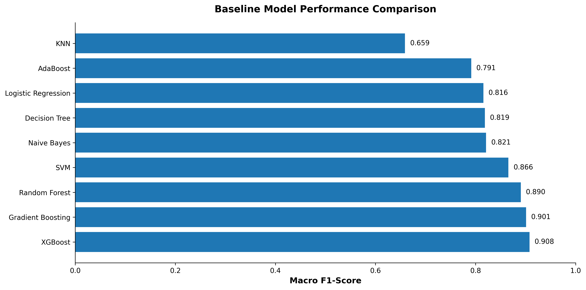
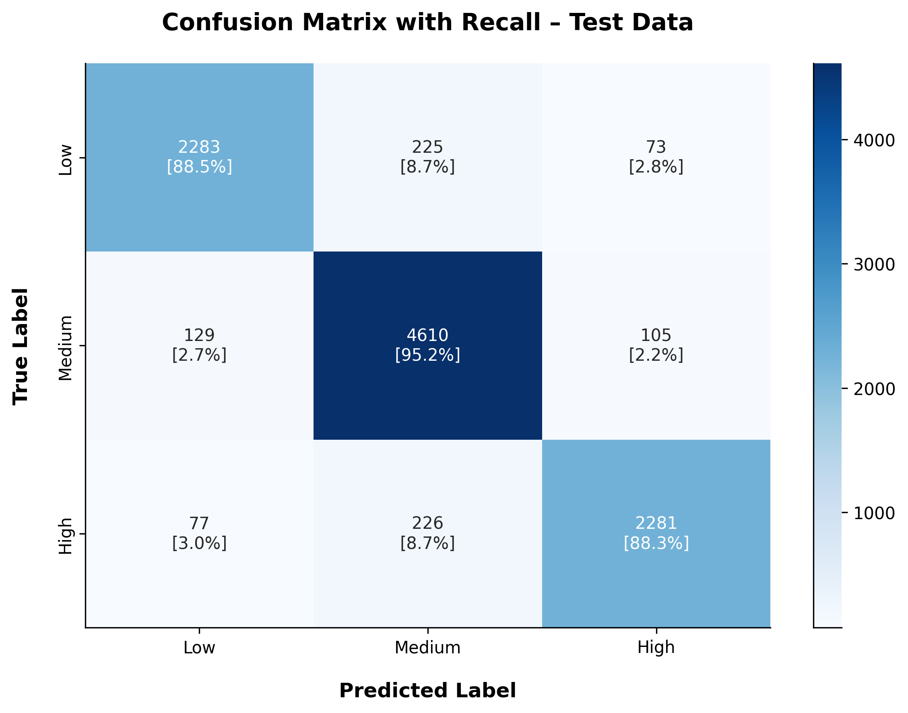
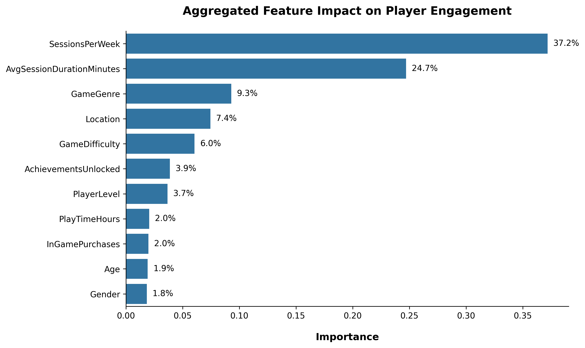
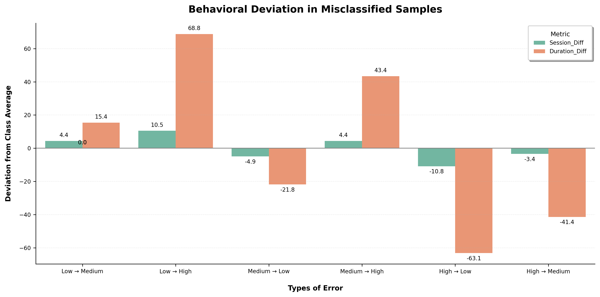

# Gaming Engagement Level Prediction

## Project Overview

This project develops a supervised multi-class classification model to predict player engagement levels (Low, Medium, High) using gameplay behavior and player attributes from an online gaming dataset containing 40,034 users.

Nine classification algorithms were evaluated using **5-fold cross-validation** with **Macro F1-score** as the primary metric.

XGBoost ranked highest among baseline models with a **CV Macro F1-score of 0.9079**. After hyperparameter tuning, performance improved to:

* **Tuned CV Macro F1:** 0.9122
* **Tuned Test Macro F1:** 0.9120
* **Improvement:** +0.0042

The minimal generalization gap confirms strong stability and absence of overfitting.

Feature importance analysis shows engagement is primarily driven by behavioral intensity — especially **SessionsPerWeek** and **AvgSessionDurationMinutes** — while demographic variables contribute limited predictive value.

The finalized preprocessing pipeline and tuned XGBoost model are integrated into a Streamlit web application for real-time prediction.

---

## Problem Statement

Player engagement directly influences retention, lifetime value, and long-term revenue growth. Early identification of engagement patterns enables:

* Personalized experiences
* Optimized gameplay design
* Targeted retention strategies
* Proactive disengagement detection

This project formulates engagement prediction as a multi-class classification problem using behavioral gameplay data.

---

## Dataset & Feature Overview

### Dataset Source

- **Name:** Online Gaming Behavior Insight
- **Source:** Kaggle
- **Link:** https://www.kaggle.com/datasets/wasiqaliyasir/online-gaming-behavior-insight
- **License:** MIT License

The dataset contains **40,034 observations** and **13 columns in total**, including:

* 11 predictive features
* 1 target variable (EngagementLevel)
* 1 identifier column (PlayerID — excluded from modeling)

### Features Used

**Demographics**

* Age
* Gender (Male, Female)
* Location (USA, Europe, Asia, Other)

**Behavioral Metrics**

* PlayTimeHours
* SessionsPerWeek
* AvgSessionDurationMinutes

**Game Attributes**

* GameGenre (Action, RPG, Simulation, Sports, Strategy)
* GameDifficulty (Easy, Medium, Hard)
* PlayerLevel
* AchievementsUnlocked

**Monetization**

* InGamePurchases (0 = No, 1 = Yes)

**Target Variable**

* EngagementLevel (Low, Medium, High)

Target distribution:

* Medium: 48.4%
* Low: 25.8%
* High: 25.8%

Due to mild imbalance, evaluation emphasized **Macro F1-score** rather than accuracy.

---

## Methodology

### Exploratory Data Analysis

* No missing values or duplicates detected.
* Numerical features showed symmetric distributions with no extreme outliers.
* Correlation analysis revealed near-zero linear relationships among numerical variables.
* SessionsPerWeek and AvgSessionDurationMinutes showed a clear increasing trend across engagement tiers.
* Categorical variables displayed similar engagement proportions, indicating weaker predictive strength compared to behavioral features.

**Modeling Implication:** Engagement is behavior-driven rather than demographic-driven.

---

### Preprocessing

* No outlier removal applied (values reflect realistic gameplay behavior).
* Stratified 75/25 train–test split to preserve class proportions.
* Target variable encoded using a predefined numeric mapping (Low = 0, Medium = 1, High = 2) for compatibility with multi-class classification models.
* Categorical features transformed using One-Hot Encoding.
* Numerical features scaled using Min–Max Scaling.
* All transformations integrated into a unified Scikit-learn Pipeline to prevent data leakage and ensure reproducibility.

---

## Model Evaluation

Nine baseline models were compared using 5-fold cross-validation:

* Logistic Regression
* KNN
* SVM
* Naive Bayes
* Decision Tree
* Random Forest
* AdaBoost
* Gradient Boosting
* XGBoost

### Baseline Performance Comparison



XGBoost demonstrated the strongest baseline performance before hyperparameter optimization.


Top baseline models:
1. XGBoost – 0.9079
2. Gradient Boosting – 0.9009
3. Random Forest – 0.8905

The top three were tuned using RandomizedSearchCV.

---

## Model Performance & Evaluation

### Performance Summary (Macro F1)

The table below compares baseline and tuned performance for the top three models using the **Macro F1-score**. All cross-validation scores were computed using 5-fold cross-validation on the training set to ensure fair and balanced multi-class evaluation.

| Model             | Baseline CV | Tuned CV |
| ----------------- | ----------- | -------- |
| XGBoost           | 0.9079      | 0.9122   |
| Gradient Boosting | 0.9009      | 0.9105   |
| Random Forest     | 0.8905      | 0.8968   |

XGBoost demonstrated the strongest performance both before and after hyperparameter tuning, indicating its superior ability to capture non-linear behavioral engagement patterns.

---

### Final Model Performance (Test Data)

The tuned XGBoost model was evaluated on the unseen test set to assess real-world generalization performance.

The model achieved a **Macro F1-score of 0.9120 on the test set**, confirming strong generalization and minimal performance degradation from cross-validation.



The confusion matrix shows strong recall across all engagement tiers, with most predictions concentrated along the diagonal. Misclassifications primarily occur between adjacent engagement levels (e.g., High → Medium or Medium → Low), indicating that errors are driven by borderline behavioral patterns rather than extreme misclassification.

Overall, the model demonstrates balanced performance across Low, Medium, and High engagement categories, validating its robustness for real-world deployment.

---

## Feature Importance



Key observations:

* **SessionsPerWeek (37.2%)** and **AvgSessionDurationMinutes (24.7%)** are the dominant drivers.
* GameGenre and Location have moderate influence.
* Demographic variables (Age, Gender) contribute minimally.

This confirms engagement is primarily driven by behavioral intensity.

---

## Error Analysis & Misclassification Insights

**Test Set Summary**

* Test samples: 10,009
* Misclassified: 835
* Error rate: **8.34%**

**Most Common Error:**
High → Medium (226 samples)

Average behavioral patterns per true class:

| Engagement | Sessions/Week | Session Duration |
| ---------- | ------------- | ---------------- |
| Low        | 4.59          | 65.96            |
| Medium     | 9.53          | 90.07            |
| High       | 14.32         | 131.43           |

Misclassifications primarily occur in **borderline behavioral cases**, where session intensity falls between adjacent tiers.



This confirms that errors are driven by transitional engagement patterns rather than random prediction failure.

---

## Deployment

The trained preprocessing pipeline and XGBoost model are serialized using Joblib and deployed via a Streamlit application that:

* Accepts player attributes
* Generates real-time predictions
* Displays confidence probabilities

This ensures that the same preprocessing steps used during training are consistently applied during inference.

---

## How to Run Locally

```
git clone https://github.com/apswalih/online-gaming-behavior-prediction.git
cd online-gaming-behavior-prediction
pip install -r requirements.txt
streamlit run app/app.py
```

---

## Project Structure

```
gaming-engagement-ml/
│
├── app/
│   └── app.py
│
├── data/
│   ├── raw/
│   │   └── online_gaming_behavior_insights.csv
│   └── processed/          # Reserved for cleaned/engineered datasets
│
├── models/
│   └── xgboost_pipeline.joblib
│
├── notebooks/
│   └── gaming_engagement_modeling.ipynb
│
├── reports/
│   └── figures/
│       ├── eda/            # 8 EDA visualizations
│       └── modeling/       # 6 modeling visualizations
│
├── .gitignore
├── README.md 
└── requirements.txt
```
---

## Technology Stack

* Python 
* Pandas 
* NumPy 
* Scikit-learn 
* XGBoost 
* Streamlit 
* Matplotlib 
* Seaborn

---

## Future Improvements

* Time-based behavioral feature engineering
* SHAP-based interpretability
* Public Streamlit deployment
* Automated retraining workflow
* Model drift monitoring

---

## Contact

Muhammed Swalih AP

For questions or collaboration, please open an issue on GitHub or contact via email.


